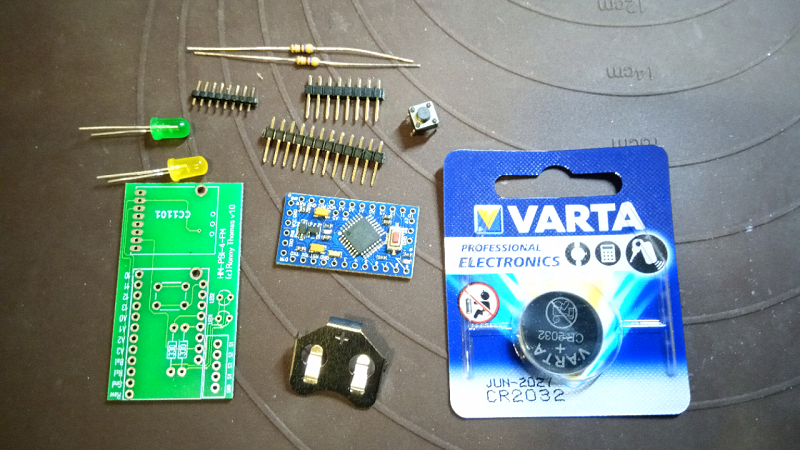
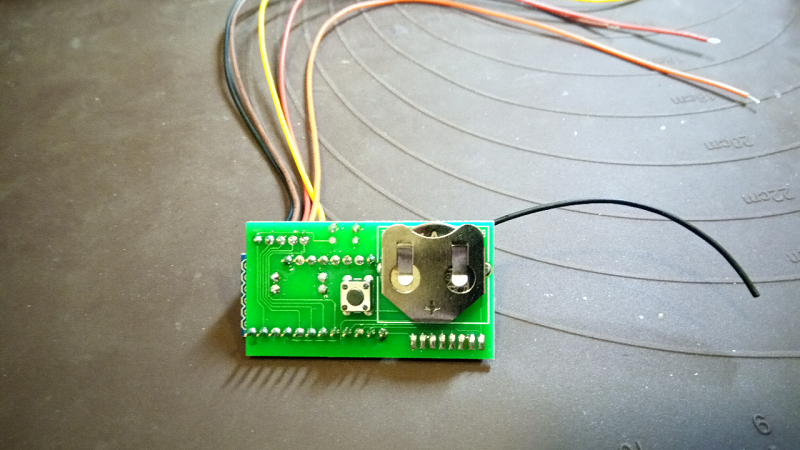

# HM-SCI-3-FM Funkschaler-Schnittstelle 3-fach
# HM-PBI-4-FM Funktaster-Schnittstelle 4-fach
## benötigte Hardware
 * 1x Arduino Pro Mini **ATmega328P (3.3V/8MHz)**
 * 1x CC1101 Funkmodul **(868 MHz)**
 * 1x FTDI Adapter (wird nur zum Flashen benötigt)
* 1x Taster 6*6
* 1x Batteriehalter print für CR2032 **Reichelt KZH 20P** oder [EBAY](https://www.ebay.de/itm/CR2012-2032-Knopfzellenhalter-max-20-mm-Silber-Printmontage-horizontal-2/253806533551?hash=item3b180c5baf:g:IOUAAOSwtlZb0KwD:rk:2:pf:0)
* 1x Batterie CR2032
Optional die LEDS und Widerstände **Verringert die Batterielaufzeit**
* 2x Widerstand 330 Ohm
* 2x LED 3mm

[Kontakt via Facebook](https://www.facebook.com/ronny.thomas.83)

[Software HM-PBI-4-FM Funktaster-Schnittstelle 4-fach ](https://github.com/jp112sdl/Beispiel_AskSinPP/blob/master/examples/HM-PBI-4-FM/HM-PBI-4-FM.ino) von Jérôme
[Software HM-SCI-3-FM Kontakt-Interface für Öffner und Schließerkontake ](https://github.com/jp112sdl/Beispiel_AskSinPP/blob/master/examples/HM-SCI-3-FM/HM-SCI-3-FM.ino) von Jérôme

HM-SCI-3-FM
Übertragungsmodus auf Standard stellt da im Sketch keine AES Verschlüsselung aktiviert ist!

HM-SCI-3-FM - Mit geänderter Software auf 4 Schaltkontakte

[Bitte vergesst das BOD Flashen des Arduinos nicht!](https://asksinpp.de/Grundlagen/FAQ/babbling_idiot.html)